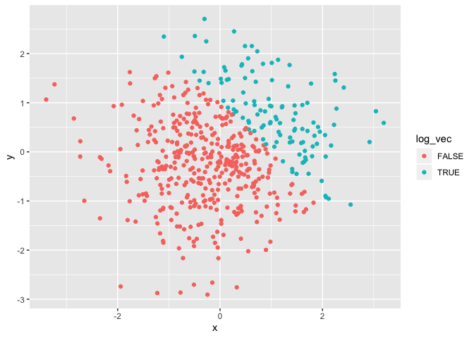
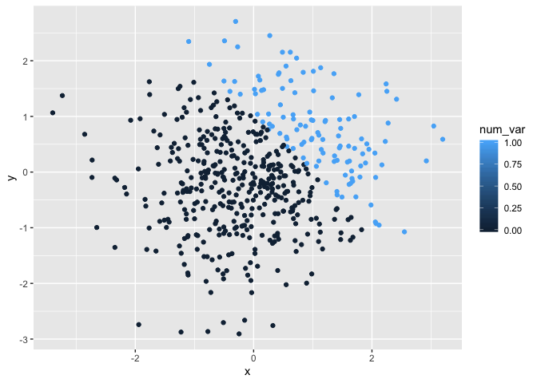

p8105\_hw1\_TS3175
================

## Below:A data frame with a random sample size of 8 from a standard normal distribution, a logical vector indicating whether elements of the sample are greater than 0, a character vector of length of 8, and a factor vector of length 8, with 3 different factor “levels”

``` r
la_df = tibble(
  norm_samp=rnorm(8),
  norm_samp_pos=norm_samp>0,
  vec_char=c("T", "A", "N", "U", "S", "R", "E", "E"),
  vec_factor= factor(c("cat", "dog", "snake", "cat", "dog", "snake", "cat", "dog")),
)
  mean(pull(la_df, norm_samp))
```

    ## [1] -0.08974342

``` r
  mean(pull(la_df,norm_samp_pos))
```

    ## [1] 0.375

``` r
  mean(pull(la_df,vec_char))
```

    ## Warning in mean.default(pull(la_df, vec_char)): argument is not numeric or
    ## logical: returning NA

    ## [1] NA

``` r
  mean(pull(la_df,vec_factor))
```

    ## Warning in mean.default(pull(la_df, vec_factor)): argument is not numeric
    ## or logical: returning NA

    ## [1] NA

## The mean of norm\_samp and norm\_samp\_pos works but the mean of vec\_char and vec\_factor do not.

``` r
  mean(as.numeric(pull(la_df,norm_samp_pos)))
  mean(as.numeric(pull(la_df,vec_char)))
```

    ## Warning in mean(as.numeric(pull(la_df, vec_char))): NAs introduced by
    ## coercion

``` r
  mean(as.numeric(pull(la_df,vec_factor)))
```

## The mean of norm\_samp and factor vector works but the mean of the character vector. It doesn’t work for character vector because it cannot be translated into numbers.

``` r
  pull(la_df,norm_samp)*(as.numeric(pull(la_df,norm_samp_pos)))
```

    ## [1] 0.0000000 0.0000000 1.0420243 0.0000000 0.0000000 1.1645820 0.5507509
    ## [8] 0.0000000

``` r
  pull(la_df,norm_samp)*(as.factor(pull(la_df,norm_samp_pos)))
```

    ## Warning in Ops.factor(pull(la_df, norm_samp), (as.factor(pull(la_df,
    ## norm_samp_pos)))): '*' not meaningful for factors

    ## [1] NA NA NA NA NA NA NA NA

``` r
  pull(la_df,norm_samp)*(as.numeric(as.factor(pull(la_df,norm_samp_pos))))
```

    ## [1] -0.1214487 -0.5798188  2.0840486 -0.3343898 -1.2197760  2.3291640
    ## [7]  1.1015019 -1.2198711

\#\#Question 2 \#\#Below is a dataframe in which x is a random sample of
500 from a normal distribution and y is a random sample of 500 from a
normal distribution and a logical vector in which x+y\>1. It also has
the logical vector coerced as a numeric vector and then factor vector.
The dataframe also includes the number of rows and the number of columns
of the dataset, the mean median, and standard deviation of x, and the
proportion of cases or which x+y\>1

``` r
set.seed(1234)
  graph_df = tibble(
  x=rnorm(500),
  y=rnorm(500),
  log_vec=x+y>1
  )
num_var=as.numeric(pull(graph_df,log_vec))
fac_var=as.factor(pull(graph_df,log_vec))
```

The data set has 500 rows and 3 columns The mean of the sample is
0.0018388 The median of the sample is -0.0207073 The standard deviation
of the sample is -0.0207073 The proportion of cases for which is 0.232

\#\#Below 3 scatterplots with descriptions
below.

``` r
  ggplot(graph_df, aes(x=x, y=y, color=log_vec)) + geom_point()
```

<!-- -->

``` r
## In the scatterplot above, true is red and it means that the value of the sum of x and y is greater than. The blue is false and it means that the value of the sume of x and y is less than 1.

  ggplot(graph_df, aes(x=x, y=y, color=num_var)) + geom_point()
```

<!-- -->

``` r
## In the scatterplot above, the lighter blue represents that the value of the sum of x and y is greater than. The darker blue represents that the value of the sume of x and y is less than 1.
  
  ggplot(graph_df, aes(x=x, y=y, color =fac_var)) + geom_point()
```

<!-- -->

``` r
## In the scatterplot above, the blue represents that the value of the sum of x and y is greater than. The red represents that the value of the sume of x and y is less than 1.
  
   ggplot(graph_df, aes(x=x, y=y, color=log_vec)) + geom_point()
```

<!-- -->

``` r
   ggsave("scatterplot.pdf", height = 4, width = 6)
```
